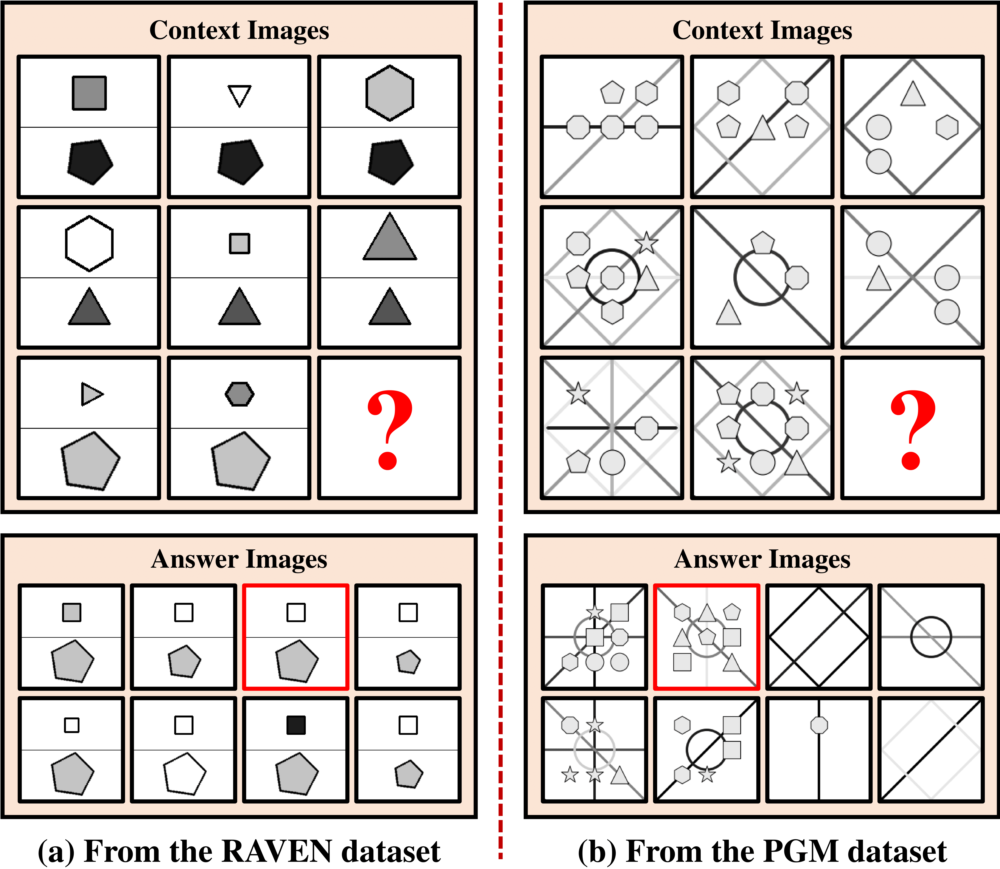

## Human-level Self-Supervised Concept Induction and Generalization via Mental Bootstrapping
[**Lingxiao Yang**](https://zjjconan.github.io/), [Muyang Lu](https://openreview.net/profile?id=~Muyang_Lyu1), [Yingjie Wang](https://ruyuanzhang.github.io/people.html), [Xiaohua Xie](http://cse.sysu.edu.cn/content/2478), [Zonglei Zhen](http://bnupsych.bnu.edu.cn/tabid/324/ArticleID/6360/frtid/307/Default.aspx), [Ru-Yuan Zhang](https://ruyuanzhang.github.io/)

This is the core implementation of our reasoning method — Self-Supervised Learning via Mental Bootstrapping (SSLvMB), which is under submission to XXXXXX. 

**Note**: This code is provided as an example for RPM-like problems only. The full implementation for both RPM-like and Bongard problems will be released upon acceptance.

--------------------------------------------------

Our environments and toolkits
-----------

- OS: Ubuntu 18.04.5
- CUDA: 11.0
- Python: 3.9.16
- Toolkit: PyTorch 1.12.1+cu102
- 4x GPU: 3090 or above
- [thop](https://github.com/Lyken17/pytorch-OpCounter)


RPM-like Problem Setting
------

The goal of each RPM-like is to choose the correct one (highlighted in red) from eight answer images to fill in the missing one (denoted by ?), making three rows or three columns with similar patterns. Obviously, a subject should recognize diverse visual objects, and then discover abstract relationships among these objects for inference.

<p align="center">

</p>


Experiments
----------

### Dataset Structure

Please prepare datasets with the following structure:


```markdown
your_dataset_root_dir/

    ├─I-RAVEN (RAVEN or RAVEN-FAIR)
    │  ├─center_single
    │  ├─distribute_four
    │  ├─distribute_nine
    │  ├─in_center_single_out_center_single
    │  ├─in_distribute_four_out_center_single
    │  ├─left_center_single_right_center_single
    │  └─up_center_single_down_center_single
    ├─PGM
    │  └─neutral
    |  └─interpolation
    |  └─extrapolation
    |  └─... (other sub-datasets)
```

### Training and Evaluation


```python
# Example for training a model on I-RAVEN
python main.py --dataset-name I-RAVEN --dataset-dir "your_dataset_root_dir" --gpu 0,1,2,3 --fp16 \
                -a sslvmb --block-drop 0.1 --classifier-drop 0.5 \
                --batch-size 128 --lr 0.001 --wd 1e-5 \
                --num-extra-stages 3 --unsupervised-training \
                --ckpt ckpts/ -p 50
```

```python
# Example for training models with multiple rounds
bash run_raven.sh (on RAVENs) or run_pgm.sh (on PGM)
```

```python
# Example for evaluating models
# using "--show-detail" to present detailed results for each configuration on RAVENs
python main.py --dataset-name I-RAVEN --dataset-dir your_dataset_root_dir --gpu 0,1,2,3 --fp16 \
               -a sslvmb --batch-size 128 --num-extra-stages 3 --ckpt ckpts/ -p 50 \
               -e --resume your_checkpoint_dir/model_best.pth.tar

# or see details in test_raven.sh
```

More running commands can be found in "run_raven.sh" and "run_pgm.sh" scripts.

All results will be released alongside the published paper.

--------------------------------------------------------------------

## Contact Information

If you have any suggestion or question, you can contact us by: lingxiao.yang717@gmail.com. Thanks for your attention!